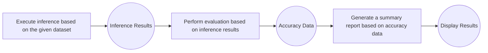
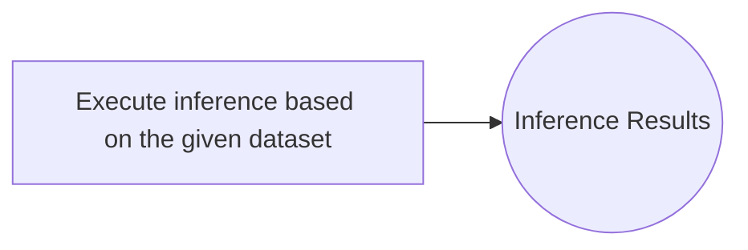
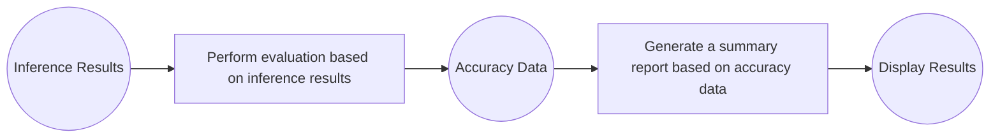
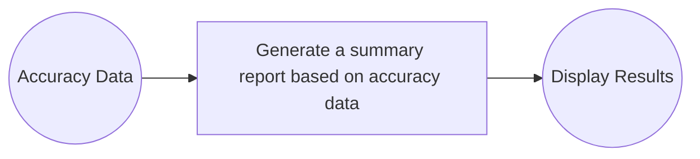
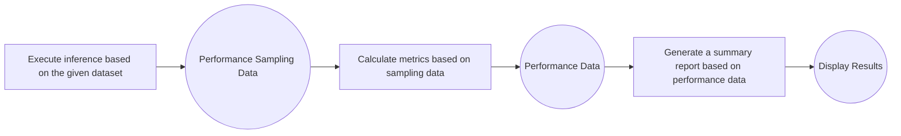
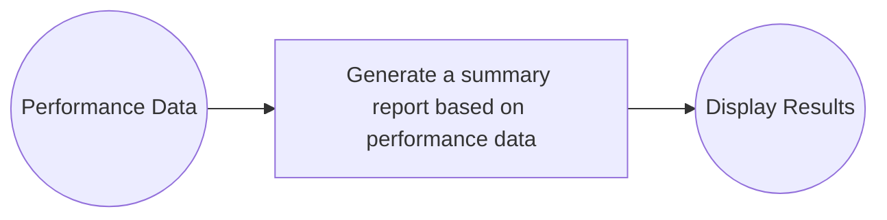

# Explanation of Running Modes
## Accuracy Evaluation Scenarios
### All Mode
In **All Mode**, the evaluation tool executes the complete workflow of **Inference → Evaluation → Summary**:

Command Example:
```shell
ais_bench --models vllm_api_general --datasets gsm8k_gen --mode all
```
Generated Directory Structure:
```bash
outputs/default/
├── 20250220_120000/        # Each experiment corresponds to a timestamp folder
├── 20250220_183030/
│   ├── configs/            # Dumped configuration files (may include configs for multiple experiments)
│   ├── logs/
│   │   ├── eval/           # Logs of the evaluation phase
│   │   └── infer/          # Logs of the inference phase
│   ├── predictions/        # Inference result data
│   ├── results/            # Evaluation results for each task
│   └── summary/            # Summary report of a single experiment
└── ...

```

### Infer Mode
In **Infer Mode**, only the inference phase is executed, and the output results are saved:

Command Example:
```shell
ais_bench --models vllm_api_general --datasets gsm8k_gen --mode infer
```
Generated Directory Structure:
```bash
outputs/default/
├── 20250220_120000/
├── 20250220_183030/
│   ├── configs/
│   ├── logs/
│   │   └── infer/
│   └── predictions/        # Contains only inference results
└── ...
```

### Eval Mode
In **Eval Mode**, evaluation and report generation are performed based on existing inference results. The `--reuse` parameter is required:

Command Example:
```shell
ais_bench --models vllm_api_general --datasets gsm8k_gen --mode eval --reuse
```
Generated Directory Structure:
```bash
outputs/default/
├── 20250220_120000/
├── 20250220_183030/
│   ├── configs/
│   ├── logs/
│   │   ├── eval/           # Newly added eval logs
│   │   └── infer/
│   ├── predictions/
│   └── results/            # Newly added evaluation result files
└── ...
```

### Viz Mode
In **Viz Mode**, only a summary report is generated and displayed based on existing accuracy data. The `--reuse` parameter is also required:

Command Example:
```shell
ais_bench --models vllm_api_general --datasets gsm8k_gen --mode viz --reuse
```

Generated Directory Structure:
```bash
outputs/default/
├── 20250220_120000/
├── 20250220_183030/
│   ├── configs/
│   ├── logs/
│   │   ├── eval/
│   │   └── infer/
│   ├── predictions/
│   ├── results/
│   └── summary/            # Newly added summary report (output of viz mode)
└── ...
```


## Performance Evaluation Scenarios
### Perf Mode
In **Perf Mode**, the evaluation tool executes the complete workflow of **Performance Sampling → Calculation → Summary** and generates a [visualization report](../results_intro/performance_visualization.md):

> ⚠️ **Note**: In the performance evaluation scenario, `--models` only supports streaming service-oriented inference APIs (refer to [Service-Oriented Inference Backend](./models.md#service-oriented-inference-backend)), such as [`vllm_api_general_stream`](https://github.com/AISBench/benchmark/tree/master/ais_bench/benchmark/configs/models/vllm_api/vllm_api_general_stream.py).

Command Example:
```shell
ais_bench --models vllm_api_general_stream --datasets synthetic_gen --mode perf
```

Example of Generated Directory Structure:
```bash
outputs/default/
├── 20200220_120000/
├── 20230220_183030/
│   ├── configs/
│   ├── logs/
│   │   └── performance/          # Performance evaluation logs
│   └── performance/              # Performance evaluation results
│       └── vllm-api-general-stream/
│           ├── syntheticdataset.csv        # Performance data of single inference requests
│           ├── syntheticdataset.json       # End-to-end performance data
│           ├── syntheticdataset_details.h5  # Full sampling ITL (Inter-Token Latency) data
│           ├── syntheticdataset_details.json  # Detailed full sampling data
│           └── syntheticdataset_plot.html     # Real-time concurrency and request visualization page
└── ...

```
- Performance sampling is based on `syntheticdataset.csv` and `syntheticdataset.json`.

### Perf_Viz Mode
In **Perf_Viz Mode**, only a summary report is generated and displayed based on existing performance data. The `--reuse` parameter is required:

Command Example:
```shell
ais_bench --models vllm_api_general_stream --datasets synthetic_gen --mode perf_viz --reuse
```
> **Explanation**: `perf_viz` will read `syntheticdataset.csv` and `syntheticdataset.json` from the most recent experiment folder, and generate visualization results based on the introduction of performance metrics.

For reference on performance evaluation results: [Explanation of Performance Evaluation Results](../results_intro/performance_metric.md#explanation-of-performance-evaluation-results)