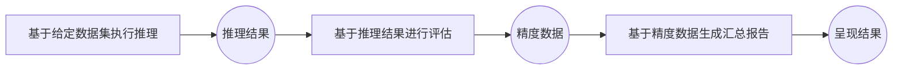
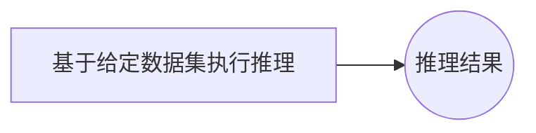
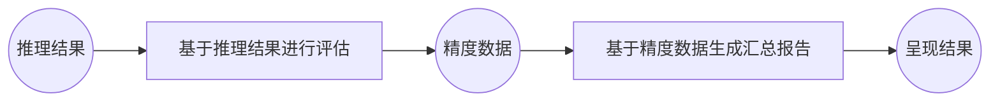
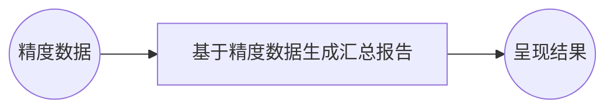
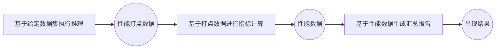
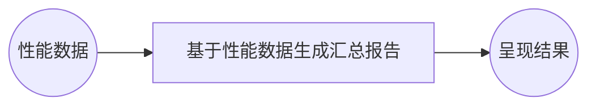

# 运行模式说明
## 精度评测场景
### all 模式
在 all 模式下，评测工具会执行完整的推理 → 评估 → 汇总流程：

命令示例：
```shell
ais_bench --models vllm_api_general --datasets gsm8k_gen --mode all
```
生成结构目录结构：
```bash
outputs/default/
├── 20250220_120000/        # 每个实验对应一个时间戳文件夹
├── 20250220_183030/
│   ├── configs/            # 已转储的配置文件（可包含多次实验的配置）
│   ├── logs/
│   │   ├── eval/           # 评估阶段日志
│   │   └── infer/          # 推理阶段日志
│   ├── predictions/        # 推理结果数据
│   ├── results/            # 每个任务的评估结果
│   └── summary/            # 单次实验的汇总报告
└── ...

```

### infer模式
在 `infer` 模式下，仅执行推理阶段并保存输出结果：

命令示例：
```shell
ais_bench --models vllm_api_general --datasets gsm8k_gen --mode infer
```
生成结构目录结构：
```bash
outputs/default/
├── 20250220_120000/
├── 20250220_183030/
│   ├── configs/
│   ├── logs/
│   │   └── infer/
│   └── predictions/        # 仅包含推理结果
└── ...
```

### eval模式
在 `eval` 模式下，基于已有的推理结果执行评估与报告生成，需要使用 `--reuse` 参数：

命令示例：
```shell
ais_bench --models vllm_api_general --datasets gsm8k_gen --mode eval --reuse
```
生成结构目录结构：
```bash
outputs/default/
├── 20250220_120000/
├── 20250220_183030/
│   ├── configs/
│   ├── logs/
│   │   ├── eval/           # 新增 eval 日志
│   │   └── infer/
│   ├── predictions/
│   └── results/            # 新增评估结果文件
└── ...
```
### viz模式
在 `viz` 模式下，仅基于已有的精度数据生成并展示汇总报告，同样需使用 `--reuse` 参数：

命令示例：
```shell
ais_bench --models vllm_api_general --datasets gsm8k_gen --mode viz --reuse
```

生成结构目录结构：
```bash
outputs/default/
├── 20250220_120000/
├── 20250220_183030/
│   ├── configs/
│   ├── logs/
│   │   ├── eval/
│   │   └── infer/
│   ├── predictions/
│   ├── results/
│   └── summary/            # 新增汇总报告（viz 输出）
└── ...
```
## 性能评测场景
### perf模式

在 `perf` 模式下，评测工具会执行完整的性能采样 → 计算 → 汇总流程，并生成[可视化报告](../results_intro/performance_visualization.md)：

> ⚠️ 注意： 性能评测场景下，`--models` 仅支持流式服务化推理 API（参考 [服务化推理API后端](./models.md#服务化推理后端)），例如 [`vllm_api_general_stream`](https://github.com/AISBench/benchmark/tree/master/ais_bench/benchmark/configs/models/vllm_api/vllm_api_general_stream.py)。

命令示例：
```shell
ais_bench --models vllm_api_general_stream --datasets synthetic_gen --mode perf
```

生成目录结构示例：
```bash
outputs/default/
├── 20200220_120000/
├── 20230220_183030/
│   ├── configs/
│   ├── logs/
│   │   └── performance/          # 性能测评日志
│   └── performance/              # 性能测评结果
│       └── vllm-api-general-stream/
│           ├── syntheticdataset.csv        # 单次推理请求性能数据
│           ├── syntheticdataset.json       # 端到端性能数据
│           ├── syntheticdataset_details.h5  # 完整打点中的ITL数据
│           ├── syntheticdataset_details.json  # 完整打点明细
│           └── syntheticdataset_plot.html     # 实时并发与请求可视化页面
└── ...

```
- 性能打点基于 `syntheticdataset.csv` 和 `syntheticdataset.json`。

### perf_viz 模式
在 `perf_viz` 模式下，仅基于已有的性能数据生成并展示汇总报告，需要使用 `--reuse` 参数：

命令示例：
```shell
ais_bench --models vllm_api_general_stream --datasets synthetic_gen --mode perf_viz --reuse
```
> **说明**：`perf_viz` 将读取最近一次实验文件夹内的 `syntheticdataset.csv` 与 `syntheticdataset.json`，并根据 性能指标介绍 生成可视化结果。

性能测评结果参考：[性能指标介绍](../results_intro/performance_metric.md#性能测评结果说明)