# 服务化精度测评
在服务化部署环境，通过标准化请求对比模型输出与标准答案，评估实际服务场景下的准确率。支持多种数据集与后端配置，便于对比不同服务化方案的模型精度。

## 服务化精度测评前置约束
在执行服务化推理前，需要满足以下条件：

- 可访问的服务化模型服务：确保服务进程可在当前环境下直接访问。
- 数据集任务准备：
    - 开源数据集：从📚 [开源数据集](../all_params/datasets.md#开源数据集)中选择数据集，并且在数据集对应的"详细介绍"文档中选择要执行的数据集任务。参考选取的数据集任务对应的"详细介绍"文档准备好数据集文件，建议将开源数据集手动放置在默认目录 `ais_bench/datasets/`下，程序将在任务执行时自动加载数据集文件。
    - 自定义数据集：无需指定数据集任务，其他配置参考📚 [自定义数据集](../../advanced_tutorials/custom_dataset.md)。
- 模型任务准备：从📚 [服务化推理后端](../all_params/models.md#服务化推理后端)中选择要执行的模型任务。

## 主要功能场景
### 单任务测评
请参考主页📚 [快速入门](../../get_started/quick_start.md)，不做赘述。

### 多任务测评
支持同时配置多个模型或多个数据集任务，通过单次命令进行批量测评，适用于大规模模型横向对比或多数据集精度对比分析。
#### 命令说明
用户可通过`--models`和`--datasets`参数指定多个配置任务，子任务数为`--models`配置任务数和`--datasets`配置任务数的乘积，即一个模型配置和一个数据集配置组成一个子任务，命令示例：
```bash
ais_bench --models vllm_api_general_chat vllm_api_stream_chat --datasets gsm8k_gen_4_shot_cot_str aime2024_gen_0_shot_chat_prompt
```
上述命令指定了2个模型任务（`vllm_api_general_chat` `vllm_api_stream_chat`）和2个数据集任务（`gsm8k_gen_4_shot_cot_str` `aime2024_gen_0_shot_chat_prompt`），将执行以下4个组合精度测试任务：

+ [vllm_api_general_chat](https://github.com/AISBench/benchmark/tree/master/ais_bench/benchmark/configs/models/vllm_api/vllm_api_general_chat.py)模型任务 + [gsm8k_gen_4_shot_cot_str](https://github.com/AISBench/benchmark/tree/master/ais_bench/benchmark/configs/datasets/gsm8k/gsm8k_gen_4_shot_cot_str.py) 数据集任务
+ [vllm_api_general_chat](https://github.com/AISBench/benchmark/tree/master/ais_bench/benchmark/configs/models/vllm_api/vllm_api_general_chat.py)模型任务 + [aime2024_gen_0_shot_chat_prompt](https://github.com/AISBench/benchmark/tree/master/ais_bench/benchmark/configs/datasets/aime2024/aime2024_gen_0_shot_chat_prompt.py) 数据集任务
+ [vllm_api_stream_chat](https://github.com/AISBench/benchmark/tree/master/ais_bench/benchmark/configs/models/vllm_api/vllm_api_stream_chat.py)模型任务 + [gsm8k_gen_4_shot_cot_str](https://github.com/AISBench/benchmark/tree/master/ais_bench/benchmark/configs/datasets/gsm8k/gsm8k_gen_4_shot_cot_str.py) 数据集任务
+ [vllm_api_stream_chat](https://github.com/AISBench/benchmark/tree/master/ais_bench/benchmark/configs/models/vllm_api/vllm_api_stream_chat.py)模型任务 + [aime2024_gen_0_shot_chat_prompt](https://github.com/AISBench/benchmark/tree/master/ais_bench/benchmark/configs/datasets/aime2024/aime2024_gen_0_shot_chat_prompt.py) 数据集任务

#### 修改任务对应的配置文件
模型任务和数据集任务对应的配置文件实际路径通过执行加`--search`命令查询：
```bash
ais_bench --models vllm_api_general_chat vllm_api_stream_chat --datasets gsm8k_gen_4_shot_cot_str aime2024_gen_0_shot_chat_prompt --search
```
查询到如下配置文件需要修改：
```bash
╒═════════════╤═════════════════════════════════╤═══════════════════════════════════════════════════════════════════════════════════════════════════════════════════════════════════╕
│ Task Type   │ Task Name                       │ Config File Path                                                                                                                  │
╞═════════════╪═════════════════════════════════╪═══════════════════════════════════════════════════════════════════════════════════════════════════════════════════════════════════╡
│ --models    │ vllm_api_general_chat           │ /your_workspace/benchmark_test/ais_bench/benchmark/configs/models/vllm_api/vllm_api_general_chat.py                               │
├─────────────┼─────────────────────────────────┼───────────────────────────────────────────────────────────────────────────────────────────────────────────────────────────────────┤
│ --models    │ vllm_api_stream_chat            │ /your_workspace/benchmark_test/ais_bench/benchmark/configs/models/vllm_api/vllm_api_stream_chat.py                                │
├─────────────┼─────────────────────────────────┼───────────────────────────────────────────────────────────────────────────────────────────────────────────────────────────────────┤
│ --datasets  │ gsm8k_gen_4_shot_cot_str        │ /your_workspace/benchmark_test/ais_bench/benchmark/configs/datasets/gsm8k/gsm8k_gen_4_shot_cot_str.py                             │
├─────────────┼─────────────────────────────────┼───────────────────────────────────────────────────────────────────────────────────────────────────────────────────────────────────┤
│ --datasets  │ aime2024_gen_0_shot_chat_prompt │ /your_workspace/benchmark_test/ais_bench/benchmark/configs/datasets/aime2024/aime2024_gen_0_shot_chat_prompt.py                   │
╘═════════════╧═════════════════════════════════╧═══════════════════════════════════════════════════════════════════════════════════════════════════════════════════════════════════╛
```
- 参考📚 [服务化推理后端配置参数说明](../all_params/models.md#服务化推理后端配置参数说明)按照实际情况配置模型任务`vllm_api_general_chat`和`vllm_api_stream_chat`对应的配置文件。
- 参考📚 [配置开源数据集](../all_params/datasets.md#配置开源数据集)按照实际情况配置数据集任务`gsm8k_gen_4_shot_cot_str`和`aime2024_gen_0_shot_chat_prompt`对应的配置文件。**注**：如果数据集放在默认目录 `ais_bench/datasets/`下，则一般不需要配置

#### 执行评测命令

执行命令：

```bash
ais_bench --models vllm_api_general_chat vllm_api_stream_chat --datasets gsm8k_gen_4_shot_cot_str aime2024_gen_0_shot_chat_prompt
```

执行过程中会在📚 [`--work-dir`](../all_params/cli_args.md#公共参数)路径（默认是`outputs/default/`）下创建时间戳目录用于保存执行细节。

任务结束后结果呈现的打屏日志示例如下：

```bash
dataset    version    metric    mode      vllm-api-general-chat    vllm-api-stream-chat
---------  ---------  --------  ------  -----------------------  ----------------------
gsm8k      84f965     accuracy  gen                        56.70                    55.97
aime2024   604a78     accuracy  gen                        50.00                    50.00
```

同时最终生成的目录结构如下：

```bash
# output/default下
20250628_172032/     # 任务创建时间对应的输出目录
├── configs          # 模型任务、数据集任务和结构呈现任务对应的配置文件合成的一个配置件
│   └── 20250628_172032_4469.py
├── logs             # 包含推理与精度评估阶段的日志
│   ├── eval         # 精度计算阶段日志
│   │   ├── vllm-api-general-chat
│   │   │   ├── aime2024.out
│   │   │   └── gsm8k.out
│   │   └── vllm-api-stream-chat
│   │       ├── aime2024.out
│   │       └── gsm8k.out
│   └── infer        # 推理阶段日志
│       ├── vllm-api-general-chat
│       │   ├── aime2024.out
│       │   └── gsm8k.out
│       └── vllm-api-stream-chat
│           ├── aime2024.out
│           └── gsm8k.out
├── predictions      # 推理结果文件，记录每条请求的输入、模型输出及参考答案（用于精度计算）
│   ├── vllm-api-general-chat
│   │   ├── aime2024.json
│   │   └── gsm8k.json
│   └── vllm-api-stream-chat
│       ├── aime2024.json
│       └── gsm8k.json
├── results         # 基于 predictions 生成的精度评估结果
│   ├── vllm-api-general-chat
│   │   ├── aime2024.json
│   │   └── gsm8k.json
│   └── vllm-api-stream-chat
│       ├── aime2024.json
│       └── gsm8k.json
└── summary        # 精度结果的汇总视图，包含 CSV、Markdown 和 TXT 格式
    ├── summary_20250628_172032.csv
    ├── summary_20250628_172032.md
    └── summary_20250628_172032.txt
```
### 多任务并行测评
默认情况下，多个子任务采用串行执行，单个任务内默认开启Continous Batch，会根据用户配置的最大并发拉起多个进程发送和处理请求，允许配置较大的并发。在单个任务并发较小时，可以通过设置📚 [`--max-num-workers`](../all_params/cli_args.md#精度测评参数)参数实现多任务并行，示例如下：

```bash
ais_bench --models vllm_api_general_chat vllm_api_stream_chat --datasets gsm8k_gen_4_shot_cot_str aime2024_gen_0_shot_chat_prompt --max-num-workers 4
```
示例中指定任务最大并发数为4，四个子任务将会同时执行，可以在命令行看板上看到：
```
Base path of result&log : outputs/default/20251106_113926
Task Progress Table (Updated at: 2025-11-06 11:39:58)
Page: 1/1  Total 5 rows of data
Press Up/Down arrow to page,  'P' to PAUZE/RESUME screen refresh, 'Ctrl + C' to exit

+--------------------------------+-----------+----------------------------------------------------+-------------+-------------+-----------------------------------------------+---------------------------------------------------+
| Task Name                      |   Process | Progress                                           | Time Cost   | Status      | Log Path                                      | Extend Parameters                                 |
+================================+===========+====================================================+=============+=============+===============================================+===================================================+
| vllm-api-general-chat/gsm8k    |   1250142 | [                              ] 5/1319 [5.0 it/s] | 0:00:07     | inferencing | logs/infer/vllm-api-general-chat/gsm8k.out    | {'POST': 10, 'RECV': 5, 'FINISH': 5, 'FAIL': 0}   |
+--------------------------------+-----------+----------------------------------------------------+-------------+-------------+-----------------------------------------------+---------------------------------------------------+
| vllm-api-general-chat/aime2024 |   1250139 | [#####                         ] 5/30 [5.0 it/s]   | 0:00:07     | inferencing | logs/infer/vllm-api-general-chat/aime2024.out | {'POST': 10, 'RECV': 5, 'FINISH': 5, 'FAIL': 0}   |
+--------------------------------+-----------+----------------------------------------------------+-------------+-------------+-----------------------------------------------+---------------------------------------------------+
| vllm-api-stream-chat/gsm8k     |   1250143 | [                              ] 5/1319 [5.0 it/s] | 0:00:07     | inferencing | logs/infer/vllm-api-stream-chat/gsm8k.out     | {'POST': 10, 'RECV': 5, 'FINISH': 5, 'FAIL': 0}   |
+--------------------------------+-----------+----------------------------------------------------+-------------+-------------+-----------------------------------------------+---------------------------------------------------+
| vllm-api-stream-chat/aime2024  |   1250138 | [###############               ] 15/30 [5.0 it/s]  | 0:00:07     | inferencing | logs/infer/vllm-api-stream-chat/aime2024.out  | {'POST': 20, 'RECV': 15, 'FINISH': 15, 'FAIL': 0} |
+--------------------------------+-----------+----------------------------------------------------+-------------+-------------+-----------------------------------------------+---------------------------------------------------+

```

生成结果与[多任务测评](#多任务测评)示例一致。


### 中断续测 & 失败用例重测
在测评过程中发生意外中断或服务器异常导致的推理任务失败时，可通过`--reuse`开启断点管理功能实现任务续测，亦支持仅对失败用例进行自动重测，无需重复运行全部任务。示例如下：

1、假设用户使用如下命令首次执行推理测评，若由于任务异常退出导致的任务中断或由于服务端异常导致部分请求失败
```bash
ais_bench --models vllm_api_general_chat --datasets demo_gsm8k_gen_4_shot_cot_chat_prompt
```
此时部分推理结果会被保存下来，在📚 [`--work-dir`](../all_params/cli_args.md#公共参数)生成如下文件内容：

```bash
# output/default下
20250628_151326/ # 测试任务创建的时间戳目录
├── configs # 模型任务、数据集任务和结构呈现任务对应的配置文件合成的一个配置
│   └── 20250628_151326_29317.py
├── logs # 执行过程中日志，命令中如果加--debug，不会有过程日志落盘（都直接打印出来了）
│   └── infer # 推理阶段日志
└── predictions # 推理结果目录，记录每条请求的输入、模型输出及答案（用于精度评估）
    └── vllm-api-general-chat
        └── tmp_demo_gsm8k   # 已完成请求的推理输出
                └── tmp_0_2766386_1749107195.json   # 缓存文件，命名格式为：tmp_{任务进程ID}_{进程编号}_{时间戳}.json
```
2、通过`--reuse`参数指定任务时间戳目录续推：
```bash
ais_bench --models vllm_api_general --datasets gsm8k_gen --reuse 20250628_151326
```
日志中会打印如下内容，提示续推任务开启：
```bash
02/20 13:14:15 - AISBench - INFO - Found 10 tmp items, run infer task from the last interrupted position
```
续推结束后，会重新所有请求的精度结果并打印，生成结果与📚 [快速入门](../../get_started/quick_start.md)示例一致。

> ⚠️ 注意：中断续测与失败重测可能改变请求顺序，可能引发结果微小波动。

💡[多任务测评](#多任务测评) 也支持全量和部分任务的中断续测 & 失败用例重测。
例如，执行如下多任务评测命令出现中断：
```bash
ais_bench --models vllm_api_general_chat vllm_api_stream_chat --datasets gsm8k_gen_4_shot_cot_str aime2024_gen_0_shot_chat_prompt
```
通过如下方式对全量任务中断续测：
```bash
ais_bench --models vllm_api_general_chat vllm_api_stream_chat --datasets gsm8k_gen_4_shot_cot_str aime2024_gen_0_shot_chat_prompt --reuse 20250628_151326
```
也可以通过如下方式仅对部分任务中断续测：
```bash
# 仅对 vllm_api_general_chat + gsm8k_gen_4_shot_cot_str 任务中断续测
ais_bench --models vllm_api_general_chat --datasets gsm8k_gen_4_shot_cot_str --reuse 20250628_151326
# 对vllm_api_general_chat + gsm8k_gen_4_shot_cot_str, vllm_api_general_chat + aime2024_gen_0_shot_chat_prompts两个任务续测
ais_bench --models vllm_api_general_chat --datasets gsm8k_gen_4_shot_cot_str aime2024_gen_0_shot_chat_prompt --reuse 20250628_151326
# 对vllm_api_general_chat + aime2024_gen_0_shot_chat_prompts, vllm_api_stream_chat + aime2024_gen_0_shot_chat_prompts两个任务续测
ais_bench --models vllm_api_general_chat vllm_api_stream_chat --datasets aime2024_gen_0_shot_chat_prompt --reuse 20250628_151326
```

### 合并子数据集推理
部分数据集会分类成不同的子数据集，在推理时会被划分为多个子任务行推理，例如：📚 [MMLU](https://github.com/AISBench/benchmark/tree/master/ais_bench/benchmark/configs/datasets/mmlu/README.md)、📚 [CEVAL](https://github.com/AISBench/benchmark/tree/master/ais_bench/benchmark/configs/datasets/ceval/README.md)。AISBench Benchmark支持将存在多个小规模数据集的数据集合并为一个任务进行统一测评。示例如下：
```bash
ais_bench --models vllm_api_general --datasets ceval_gen --merge-ds
```
> ⚠️ 注意：合并模式下将只生成整体结果，子数据集精度不再单独列出。同时对合并模式下中断或失败的推理结果进行数据集中断续测 & 失败用例重测也必须在命令中加`--merge-ds`

### 固定请求数测评

当集规模过大，只想针数据对部分样本执行性能测试时，可使用 📚 [`--num-prompts`](../all_params/cli_args.md#性能测评参数) 参数指定读取的数据条数。示例如下：
```bash
ais_bench --models vllm_api_stream_chat --datasets demo_gsm8k_gen_4_shot_cot_chat_prompt --num-prompts 1
```
上述命令仅对示例数据集中的第一条记录进行推理并只对这一条记录进行精度评估。
> ⚠️ 注意：当前数据集会按照默认队列顺序依次读取，不支持随机抽样或打乱顺序。

### 多次独立重复推理

> 该功能开启后，由于`数据集`/`请求数量`将按照`数据点级别`成倍扩充，从而导致推理时间显著变长，且使用内存显著提高。请在阅读 📚 [精度评测场景：评估指标解析](../results_intro/accuracy_metric.md) 后，**确认当前场景是否需要开启该功能**。

该场景旨在从可靠性、稳定性、整体准确性等多维度探究模型能力，开启方式为：在 `服务化推理后端配置参数` 中的超参 `generation_kwargs` 中配置 🔗[`num_return_sequences`参数数值](../all_params/models.md#服务化推理后端配置参数说明)，格式按照以下示例内容（取值仅供参考）：

```python
models = [
    dict(
        ... # 其它参数
        generation_kwargs = dict(
            num_return_sequences = 5, # 具体作用和约束请参考文档 accuracy_metric.md
            ... # 其它参数
        ),
        ...
    )
]
```

精度评估阶段结束后，结果会记录在日志和打屏在运行窗口，格式按照以下示例内容（数据仅供参考）：

```bash
| dataset   | version   | metric                    | mode | vllm-api-stream-chat |
| --------- | --------- | ------------------------- | ---- | -------------------- |
| aime2024  | 604a78    | accuracy (5 runs average) | gen  | 18.00                |
| aime2024  | 604a78    | avg@5                     | gen  | 18.00                |
| aime2024  | 604a78    | pass@5                    | gen  | 53.33                |
| aime2024  | 604a78    | cons@5                    | gen  | 13.33                |
```

上表中，**具体指标解读**和**参数约束** 请参考📚 [精度评测场景：评估指标解析](accuracy_metric.md)

## 其他功能场景
### 推理结果重评估
主要功能场景下评测任务的执行流程包括完整的推理 → 评估 → 汇总流程：

```mermaid
graph LR;
  A[基于给定数据集执行推理] --> B((推理结果))
  B --> C[基于推理结果进行评估]
  C --> D((精度数据))
  D --> E[基于精度数据生成汇总报告]
  E --> F((呈现结果))
```

整个执行流程中的每个环节都是独立解耦的，推理结果是可以反复重评估的，如果第一次执行精度评测的到的精度数据有问题（比如没有准确得提取出response中有价值的内容），就可以修改答案提取的方式，执行推理结果重评估。具体操作如下。

假设上次执行性能测评的命令是：
```bash
ais_bench --models vllm_api_general_chat --datasets demo_gsm8k_gen_4_shot_cot_chat_prompt
```
同时提示落盘的时间戳为`20250628_151326`，但是8条case的精度数据有问题，只得了0分：
```bash
dataset                 version  metric   mode  vllm_api_general_chat
----------------------- -------- -------- ----- ----------------------
demo_gsm8k              401e4c   accuracy gen                   00.00
```
查看`20250628_151326/predictions/vllm-api-general-chat/gsm8k.json`，发现推理结果中实际给了正确的答案。这个时候可以修改`gsm8k_gen_4_shot_cot_chat_prompt`数据集任务对应的配置文件，通过`--search`命令查询对应的配置文件路径：
```bash
ais_bench --datasets gsm8k_gen_4_shot_cot_chat_prompt --search
```
得到配置文件路径：
```bash
╒═════════════╤═══════════════════════════════════════╤═════════════════════════════════════════════════════════════════════════════════════════════════════════════════════════════════════╕
│ Task Type   │ Task Name                             │ Config File Path                                                                                                                    │
╞═════════════╪═══════════════════════════════════════╪═════════════════════════════════════════════════════════════════════════════════════════════════════════════════════════════════════╡
│ --datasets  │ gsm8k_gen_4_shot_cot_chat_prompt │ /your_workspace/ais_bench/benchmark/configs/datasets/gsm8k/gsm8k_gen_4_shot_cot_chat_prompt.py                                           │
╘═════════════╧═══════════════════════════════════════╧═════════════════════════════════════════════════════════════════════════════════════════════════════════════════════════════════════╛

```
打开`gsm8k_gen_4_shot_cot_chat_prompt.py`替换或修改答案的提取函数
```python
# ......
from ais_bench.benchmark.datasets import GSM8KDataset, gsm8k_postprocess, gsm8k_dataset_postprocess, Gsm8kEvaluator
gsm8k_reader_cfg = dict(input_columns=['question'], output_column='answer')

# ......
gsm8k_eval_cfg = dict(evaluator=dict(type=Gsm8kEvaluator),
                      pred_role='BOT',
                      pred_postprocessor=dict(type=gsm8k_postprocess), # 替换或修改答案的提取函数的实现
                      dataset_postprocessor=dict(type=gsm8k_dataset_postprocess))
# ......

```

可以在第一次精度评测命令的基础上假设`--mode eval`和`--reuse {复用的推理结果所在的时间戳}`反复重评估：
```bash
ais_bench --models vllm_api_general_chat --datasets demo_gsm8k_gen_4_shot_cot_chat_prompt --mode eval --reuse 20250628_151326

```